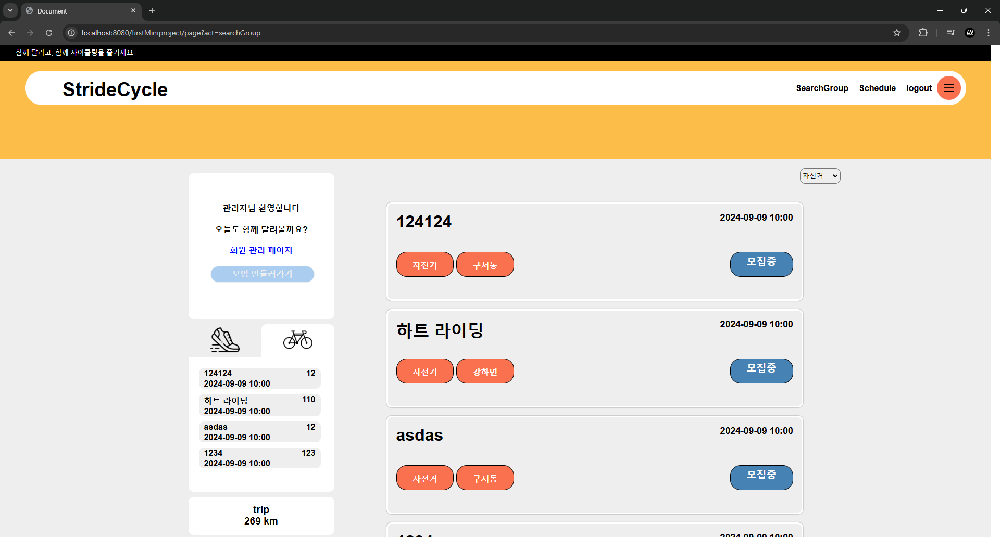
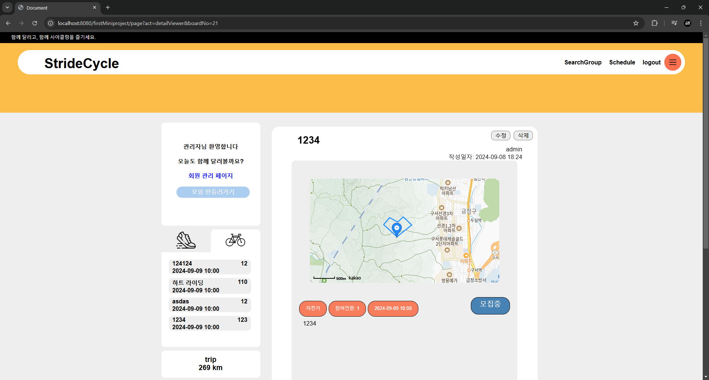
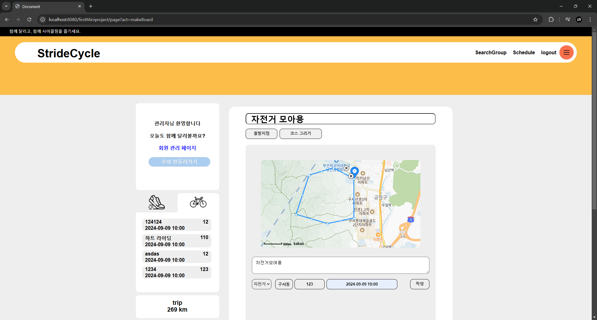
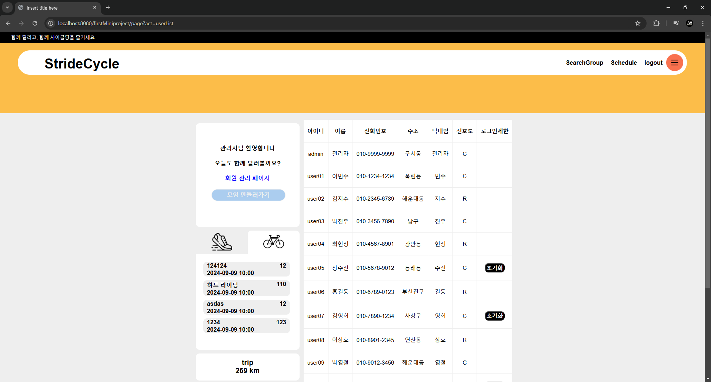

# 📚 프로젝트명: StrideCycle

## 1. 프로젝트 개요

### 프로젝트 요약
JSP와 MVC패턴을 활용해 만들어진 러닝/사이클링 동호회 모임 웹 사이트입니다. 
동호회를 모을 때 러닝, 사이클링 코스를 미리 정하고 공개하여 모집할 수 있습니다.
**회원가입, 로그인, 코스 그리기, 인원 모집 및 신청, 취향에 맞는 동호회 보여주기** 등의  등의 기능이 있습니다.

### 프로젝트 목표
> Session을 이용해 고객의 정보를 확인하고 그에 맞는 화면을 출력 
게시판 및 회원 정보 관리를 통해 CRUD를 구현 
KAKAO MAP API를 이용해 런닝, 사이클링 코스를 출력

<!-- 2024.08.13 - 2024.08.20 -->

### 기술 스택

## 2. 기능 설명

### 핵심 기능 목록

- **사용자 관리**: 회원가입, 로그인, 일정 횟수 로그인 실패 시 잠김 및 관리자 문의
    - 회원가입 시 기본적인 중복 체크 및 선택한 시/구에 맞는 지역정보 선택리스트 출력
    - 로그인 시 session을 이용한 로그인 정보 관리
    - 5회 이상 로그인 실패 시 계정 로그인 불가 -> 관리자 문의 시 관리자에게 문의 후 해제
- **모임**: 러닝/사이클링 모임 생성 및 코스 지정, 가입된 모임, 전체 모임 확인
    - 로그인 시 러닝/사이클링 선호도에 맞춤 모임 리스트를 최신순으로 출력
    - 내가 가입한 러닝/사이클링 표시 및 총 거리 출력
    - 모임 생성 시 내 주소를 기준으로 kakao map api를 출력해주고 지정한 코스 그리기 가능
    

### UI/UX 설명
> **홈 화면**: 
 로그인 시 취향에 맞는 모임 리스트를 우선으로 출력해준다. 모집중인 경우 신청이 가능. 
 좌측 사이드바에서 모임 생성, 내가 가입한 최근 모임들, 총 러닝/사이클링 거리가 표시된다.

> **모임 디테일**: 
 모임의 상세한 정보를 보여준다. 계획된 코스, 출발점을 알려주고 현재 참여인원, 참여 날짜, 모집 여부 및 소개글이 작성되어있다.

> **피드 작성**: 
 모임 구인글을 작성한다. 출발지점 및 코스를 그릴 수 있다.

> **회원 관리 페이지**: 
 가입된 유저의 정보를 보여준다. 비밀번호를 여러번 틀린 경우 초기화를 해줘야 로그인 가능하다.

## 3. 프로젝트 구조

### 클라이언트-서버 구조
MVC 패턴의 틀을 처음 접하여 프론트엔드와 백엔드를 분리하고, 프론트엔드는 JSP, 백엔드는 JAVA를 이용한 MVC 패턴으로 만들어봤습니다. MainDAO부분에서 DB 커넥션을 관리하고 해당 DAO를 상속받아 DB에 연결합니다.
프론트엔드에서는 JQuery를 이용해 Ajax 통신을 하여 데이터를 요청하고 Controller에서 해당 통신을 관리합니다. 
- **KAKAO MAP API** 
KAKAO MAP API를 이용해서 지도를 불러오고 그려옵니다. 사용자가 등록한 지역을 기반으로 지도를 보여주고 API를 이용해 가져온 정보들을 json형식으로 DB에 저장하여 코스를 기록하고 보여줍니다.

- **session** 
 사용자 인증을 위해 session을 활용하여, 사용자 로그인 정보를 서버쪽에서 처리했습니다.

- **비동기 통신** 
 Ajax를 통해 비동기 통신을 구현하여 데이터를 주고받습니다.

## 4. 주요 기술적 문제와 해결 방법
1. 처음 사용해보는 API 및 데이터의 구조 파악 미숙 
**문제:** API를 처음 사용해보았고, 데이터를 주고받는 과정에서 해당 데이터의 타입 등에 대한 파악이 미숙하여 지도를 그리는데 어려움이 있었습니다. 
**해결:** 해당 API를 개발자문서를 더 자세히 살펴보고 샘플 코드를 참고하여 테스트 코드들을 작성해보고 수정해나갔습니다. 샘플 코드는 제가 원했던 기능이나 얻게되는 자료 구조가 일치하지 않아 시간이 소요되었지만 포기하지않고 주고받는 데이터들을 개발자도구를 통해 확인해가며 파악하여 DB에 json타입으로 저장해 해결했습니다.

## 5. 배운 점/ 아쉬운 점
#### 아쉬운 점
- 새로운 API를 경험해보고 원하는대로 커스텀해보면서 즐거운 경험이었지만 해당 기능에 시간이 오래 투자되면서 기본적인 디테일을 많이 놓친 것 같아 아쉬웠습니다.
#### 배운 점
- 서버와 통신을 하거나 API를 이용한 통신을 할 때 비동기적인 특성으로 인해 생길 수 있는 이슈들을 많이 접하고 해결했습니다.
- 고정적인 화면을 출력하는게 아닌 데이터의 데이터와 세션 등을 통해서 화면을 동적으로 출력하는 법을 익혔습니다.

